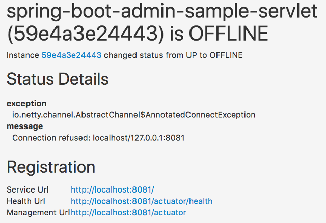

=== 消息通知 ===

[[mail-notifications]]
==== 邮件通知 ====

邮件通知是以HTML格式渲染的电子邮件，它使用 https://www.thymeleaf.org/[Thymeleaf] 作为模板。 要想开启邮件通知，需要使用 `spring-boot-starter-mail` 配置 `JavaMailSender` 并设置一个收件人。

.邮件通知的例子

NOTE: 为了防止敏感信息被泄露，默认邮件模板中不显示任何实例的元数据。如果你想显示的话，可以自定义模板。

. 将spring-boot-starter-mail添加到依赖中:
+
[source,xml]
.pom.xml
----
<dependency>
    <groupId>org.springframework.boot</groupId>
    <artifactId>spring-boot-starter-mail</artifactId>
</dependency>
----

. 配置一个JavaMailSender
+
.application.properties
----
spring.mail.host=smtp.example.com
spring.boot.admin.notify.mail.to=admin@example.com
----

. 根据下面的可选项配置邮件
+
.邮件提醒配置的可选项
|===
| 属性名 |说明 |面若防治

| spring.boot.admin.notify.mail.enabled
| 开启邮件提醒
| `true`

| spring.boot.admin.notify.mail.ignore-changes
| 要忽略的状态变化，使用逗号分割。格式是: "<from-status>:<to-status>"。允许使用通配符
| `"UNKNOWN:UP"`

| spring.boot.admin.notify.mail.template
| 用于渲染的Thymeleaf模板路径
| `"classpath:/META-INF/spring-boot-admin-server/mail/status-changed.html"`

| spring.boot.admin.notify.mail.to
| 邮件收件人列表，用逗号进行分割
| `"root@localhost"`

| spring.boot.admin.notify.mail.cc
| 副本收件人列表，用逗号分割
|

| spring.boot.admin.notify.mail.from
| 邮件发送人
| `"Spring Boot Admin <noreply@localhost>"`

| spring.boot.admin.notify.mail.additional-properties
| 可以从模板读取的其它属性
|

|===

[[pagerduty-notifications]]
==== PagerDuty通知 ====

To enable https://www.pagerduty.com/[PagerDuty] notifications you just have to add a generic service to your PagerDuty-account and set `spring.boot.admin.notify.pagerduty.service-key` to the service-key you received.

.PagerDuty notifications configuration options
|===
| Property name |Description |Default value

| spring.boot.admin.notify.pagerduty.enabled
| Enable mail notifications
| `true`

| spring.boot.admin.notify.pagerduty.ignore-changes
| Comma-delimited list of status changes to be ignored. Format: "<from-status>:<to-status>". Wildcards allowed.
| `"UNKNOWN:UP"`

| spring.boot.admin.notify.pagerduty.service-key
| Service-key to use for PagerDuty
|

| spring.boot.admin.notify.pagerduty.url
| The Pagerduty-rest-api url
| `+++"https://events.pagerduty.com/generic/2010-04-15/create_event.json"+++`

| spring.boot.admin.notify.pagerduty.description
| Description to use in the event. SpEL-expressions are supported
| `+++"#{instance.registration.name}/#{instance.id} is #{instance.statusInfo.status}"+++`

| spring.boot.admin.notify.pagerduty.client
| Client-name to use in the event
|

| spring.boot.admin.notify.pagerduty.client-url
| Client-url to use in the event
|
|===

[[opsgenie-notifications]]
==== OpsGenie通知 ====

To enable https://www.opsgenie.com/[OpsGenie] notifications you just have to add a new JSON Rest API integration to your OpsGenie account and set `spring.boot.admin.notify.opsgenie.api-key` to the apiKey you received.

.OpsGenie notifications configuration options
|===
| Property name |Description |Default value

| spring.boot.admin.notify.opsgenie.enabled
| Enable OpsGenie notifications
| `true`

| spring.boot.admin.notify.opsgenie.ignore-changes
| Comma-delimited list of status changes to be ignored. Format: "<from-status>:<to-status>". Wildcards allowed.
| `"UNKNOWN:UP"`

| spring.boot.admin.notify.opsgenie.api-key
| apiKey you received when creating the integration
|

| spring.boot.admin.notify.opsgenie.url
| OpsGenie Alert API url
| `+++"https://api.opsgenie.com/v2/alerts"+++`

| spring.boot.admin.notify.opsgenie.description
| Description to use in the event. SpEL-expressions are supported
| `+++"#{instance.registration.name}/#{instance.id} is #{instance.statusInfo.status}"+++`

| spring.boot.admin.notify.opsgenie.actions
| Comma separated list of actions that can be executed.
|

| spring.boot.admin.notify.opsgenie.source
| Field to specify source of alert. By default, it will be assigned to IP address of incoming request.
|

| spring.boot.admin.notify.opsgenie.tags
| Comma separated list of labels attached to the alert.
|

| spring.boot.admin.notify.opsgenie.entity
| The entity the alert is related to.
|

| spring.boot.admin.notify.opsgenie.user
| Default owner of the execution. If user is not specified, the system becomes owner of the execution.
|
|===

[[hipchat-notifications]]
==== Hipchat通知 ====

To enable https://www.hipchat.com/[Hipchat] notifications you need to create an API token on your Hipchat account and set the appropriate configuration properties.

.Hipchat notifications configuration options
|===
| Property name |Description |Default value

| spring.boot.admin.notify.hipchat.enabled
| Enable Hipchat notifications
| `true`

| spring.boot.admin.notify.hipchat.ignore-changes
| Comma-delimited list of status changes to be ignored. Format: "<from-status>:<to-status>". Wildcards allowed.
| `"UNKNOWN:UP"`

| spring.boot.admin.notify.hipchat.url
| The HipChat REST API (V2) URL
|

| spring.boot.admin.notify.hipchat.auth-token
| The API token with access to the notification room
|

| spring.boot.admin.notify.hipchat.room-id
| The ID or url-encoded name of the room to send notifications to
|

| spring.boot.admin.notify.hipchat.notify
| Whether the message should trigger a user notification
| `false`

| spring.boot.admin.notify.hipchat.description
| Description to use in the event. SpEL-expressions are supported
| `+++"&lt;strong&gt;#{instance.registration.name}&lt;/strong&gt;/#{instance.id} is &lt;strong&gt;#{event.statusInfo.status}&lt;/strong&gt;"+++`
|
|===

[[slack-notifications]]
==== Slack通知 ====

To enable https://slack.com/[Slack] notifications you need to add a incoming Webhook under custom integrations on your Slack account and configure it appropriately.

.Slack notifications configuration options
|===
| Property name |Description |Default value

| spring.boot.admin.notify.slack.enabled
| Enable Slack notifications
| `true`

| spring.boot.admin.notify.slack.ignore-changes
| Comma-delimited list of status changes to be ignored. Format: "<from-status>:<to-status>". Wildcards allowed.
| `"UNKNOWN:UP"`

| spring.boot.admin.notify.slack.webhook-url
| The Slack Webhook URL to send notifications to.
|

| spring.boot.admin.notify.slack.channel
| Optional channel name (without # at the beginning). If different than channel in Slack Webhooks settings
|

| spring.boot.admin.notify.slack.icon
| Optional icon name (without surrounding colons). If different than icon in Slack Webhooks settings
|

| spring.boot.admin.notify.slack.username
| Optional username to send notification if different than in Slack Webhooks settings
| `Spring Boot Admin`

| spring.boot.admin.notify.slack.message
| Message to use in the event. SpEL-expressions and Slack markups are supported
| `+++"*#{instance.registration.name}* (#{instance.id}) is *#{event.statusInfo.status}*"+++`
|
|===

[[letschat-notifications]]
==== Let's Chat通知 ====

To enable https://sdelements.github.io/lets-chat/[Let's Chat] notifications you need to add the host url and add the API token and username from Let's Chat

.Let's Chat notifications configuration options
|===
| Property name |Description |Default value

| spring.boot.admin.notify.letschat.enabled
| Enable let´s Chat notifications
| `true`

| spring.boot.admin.notify.letschat.ignore-changes
| Comma-delimited list of status changes to be ignored. Format: "<from-status>:<to-status>". Wildcards allowed.
| `"UNKNOWN:UP"`

| spring.boot.admin.notify.letschat.url
| The let´s Chat Host URL to send notifications
|

| spring.boot.admin.notify.letschat.room
| the room where to send the messages
|

| spring.boot.admin.notify.letschat.token
| the token to access the let´s Chat API
|

| spring.boot.admin.notify.letschat.username
| The username for which the token was created
| `Spring Boot Admin`

| spring.boot.admin.notify.letschat.message
| Message to use in the event. SpEL-expressions are supported
| `+++"*#{instance.registration.name}* (#{instance.id}) is *#{event.statusInfo.status}*"+++`
|
|===

[[ms-teams-notifications]]
==== Microsoft Teams通知 ====

To enable Microsoft Teams notifications you need to setup a connector webhook url and set the appropriate configuration property.

.Microsoft Teams notifications configuration options
|===
| Property name |Description |Default value

| spring.boot.admin.notify.ms-teams.enabled
| Enable Microsoft Teams notifications
| `true`

| spring.boot.admin.notify.ms-teams.webhook-url
| The Microsoft Teams webhook url to send the notifications to.
|

| spring.boot.admin.notify.ms-teams.deRegisteredTitle
| Title of the Teams message when an app de-registers.
| De-Registered

| spring.boot.admin.notify.ms-teams.registeredTitle
| Title of the Teams message when an app dregisters.
| Registered

| spring.boot.admin.notify.ms-teams.statusChangedTitle
| Title of the Teams message when an app changes status.
| Status Changed

| spring.boot.admin.notify.ms-teams.messageSummary
| Summary section of every Teams message originating from Spring Boot Admin.
| Spring Boot Admin Notification

| spring.boot.admin.notify.ms-teams.theme_color
| Set the theme color. SpEL-expressions are supported.
| `#{event.type == 'STATUS_CHANGED' ? (event.statusInfo.status=='UP' ? '6db33f' : 'b32d36') : '439fe0'}`

| spring.boot.admin.notify.ms-teams.deregister_activity_subtitle
| Subtitle of the Activity section of the Teams message when an app de-registers. SpEL-expressions are supported.
| `#{instance.registration.name} with id #{instance.id} has de-registered from Spring Boot Admin`

| spring.boot.admin.notify.ms-teams.register_activity_subtitle
| Subtitle of the Activity section of the Teams message when an app registers. SpEL-expressions are supported.
| `#{instance.registration.name} with id #{instance.id} has registered with Spring Boot Admin`

| spring.boot.admin.notify.ms-teams.status_activity_subtitle
| Subtitle of the Activity section of the Teams message when an app changes status. SpEL-expressions are supported.
| `#{instance.registration.name} with id #{instance.id} changed status from #{lastStatus} to #{event.statusInfo.status}`
|===

[[telegram-notifications]]
==== Telegram通知 ====

To enable https://telegram.org/[Telegram] notifications you need to create and authorize a telegram bot and set the appropriate configuration properties for auth-token and chat-id.

.Telegram notifications configuration options
|===
| Property name |Description |Default value

| spring.boot.admin.notify.telegram.enabled
| Enable Telegram notifications
| `true`

| spring.boot.admin.notify.telegram.auth-token
| The token identifying und authorizing your Telegram bot (e.g. `123456:ABC-DEF1234ghIkl-zyx57W2v1u123ew11`).
|

| spring.boot.admin.notify.telegram.chat-id
| Unique identifier for the target chat or username of the target channel
|

| spring.boot.admin.notify.telegram.disable-notify
| If true users will receive a notification with no sound.
| `false`

| spring.boot.admin.notify.telegram.parse_mode
| The parsing mode for the sent message. Currently ``HTML'` and `'Markdown'` are supported.
| `'HTML'`

| spring.boot.admin.notify.telegram.message
| Text to send. SpEL-expressions are supported.
| `+++"&lt;strong&gt;#{instance.registration.name}&lt;/strong&gt;/#{instance.id} is &lt;strong&gt;#{event.statusInfo.status}&lt;/strong&gt;"+++`
|===

[[discord-notifications]]
==== Discord通知 ====

To enable Discord notifications you need to create a webhook and set the appropriate configuration property.

.Discord notifications configuration options
|===
| Property name |Description |Default value

| spring.boot.admin.notify.discord.enabled
| Enable Discord notifications
| `true`

| spring.boot.admin.notify.discord.webhook-url
| The Discord webhook url to send the notifications to.
|

| spring.boot.admin.notify.discord.username
| Optional username.
| __Default set in Discord__

| spring.boot.admin.notify.discord.avatar-url
| Optional URL to avatar.
| __Default set in Discord__

| spring.boot.admin.notify.discord.tts
| If the message is a text to speech message.
| `false`

| spring.boot.admin.notify.discord.message
| Text to send. SpEL-expressions are supported.
| `+++"*#{instance.registration.name}* (#{instance.id}) is *#{event.statusInfo.status}*"+++`
|===

[[notification-proxy]]
==== 为消息通知配置代理 ====

所有的消息通知都是使用 `RestTemplate` 来进行发送的，所以我们可以为其配置一个代理。

.通知代理的可选配置
|===
| 属性名 |说明 |默认值

| spring.boot.admin.notify.proxy.host
| 代理的 host
|

| spring.boot.admin.notify.proxy.port
| 代理的 port
|

| spring.boot.admin.notify.proxy.username
| 代理的 username (如果代理需要身份认证的话)
|

| spring.boot.admin.notify.proxy.password
| 代理的 password (如果代理需要身份认证的话)
|
|===

[[reminder-notifications]]
==== 通知发送程序 ====

`RemindingNotifier` 会在应用停机/离线的时候发送消息通知，它会将通知的发送委托给另外一个通知发送程序。

默认情况下，这个通知发送程序会在一个已注册发生 `停机` 或 `离线` 的时候触发。
你也可以通过 `setReminderStatuses()` 来修改这个行为。
当这个状态变成了无需触发，或者是相关服务注销了的话，这个通知发送程序就会结束。

默认情况下，通知发送程序每隔10分钟发送一次，可以使用 `setReminderPeriod()` 对这个间隔进行修改。
`RemindingNotifier` 本身不会开启后台线程来调用通知发送程序，你需要按照下面的示例来处理这个问题;

.如何配置通知发送程序
[source,java]
----
@Configuration
public class NotifierConfiguration {
    @Autowired
    private Notifier notifier;

    @Primary
    @Bean(initMethod = "start", destroyMethod = "stop")
    public RemindingNotifier remindingNotifier() {
        RemindingNotifier notifier = new RemindingNotifier(notifier, repository);
        notifier.setReminderPeriod(Duration.ofMinutes(10)); // <1>
        notifier.setCheckReminderInverval(Duration.ofSeconds(10)); //<2>
        return notifier;
    }
}
----

<1> 通知发送程序会每隔10分钟发送一次。
<2> 每隔10秒种安排一次通知发送。

[[filtering-notifications]]
==== 过滤通知 ====

`FilteringNotifier` 允许在运行时添加/删除消息通知过滤的规则。
它会将通知的发送委托给另一个发送程序。

如果向 `ApplicationContext` 添加了 `FilteringNotifier`，那么RESTful页面中的 `消息通知/过滤器` 就可以访问了。

尤其时在部署应用的时候，如果你不想接受提醒，此时过滤器就能帮到你。
在停止应用之前你可以通过 `POST` 请求发送一个（带有过期时间的）过滤条件。

.如何配置过滤器
[source,java,indent=0]
----
include::{samples-dir}/spring-boot-admin-sample-servlet/src/main/java/de/codecentric/boot/admin/NotifierConfig.java[tags=configuration-filtering-notifier]
----

<1> 使用delegate添加一个 `FilteringNotifier` Bean (例如在配置 `MailNotifier` 时)
<2> 使用 `FilteringNotifier` 作为delegate，将 `RemindingNotifier` 添加为primary bean。

TIP: 这个示例结合了消息提醒和通知过滤。
这可以让你在部署应用后的一段时间内（直到过滤条件过期）不会收到消息通知。

[[DingTalk-notifications]]
==== 钉钉通知 ====

要想启用 https://www.dingtalk.com/[DingTalk] 消息通知，你需要创建并配置钉钉机器人的授权，并为 webhookUrl 和 secret 提供正确的配置。

.钉钉消息通知配置可选项
|===
| 属性名 |说明 |默认值

| spring.boot.admin.notify.dingtalk.enabled
| 开启钉钉消息通知。
| `true`

| spring.boot.admin.notify.dingtalk.webhook-url
| 钉钉通知将要发送的webhook url。
|

| spring.boot.admin.notify.dingtalk.secret
| 消息认证的secret。
|

| spring.boot.admin.notify.dingtalk.message
| 发送的文本，支持SpEL表达式。
| `+++"#{instance.registration.name} #{instance.id} is #{event.statusInfo.status} "+++`
|===
